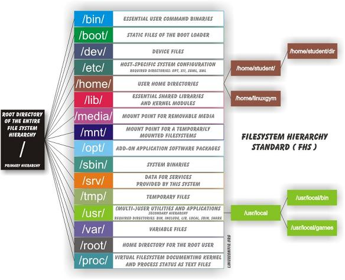

---

# Basics of linux

This is a huge chapter. I could divide it up in many subchapters but I like to have it all at one place so I can just do `ctr-f`, and search for whatever I am looking for.

## 1. The Shell - Bash

The shell, or the terminal is a really useful tool. Bash is the standard shell on most Linux distros.

One really useful trick when working with bash is to search for old commands that you have used. You can access this search function by doing `ctr-r` in the terminal.

The configuration file for the bash shell is `~./bashrc`

### Navigating

`pwd` - Print working directory

`cd` - Change directory

`cd ~` - Change directory to your home directory

`cd -` - Go back to previous directory

### Looking at files

`ls` - List files in directory

`ls -ltr` - Sort list by last modified. -time -reverse

`file` - Show info about file. What type of file it is. If it is a binary or text file for example.

`cat` - Output content of file.

`less` - Output file but just little bit at a time. Use this one. Not `more`.

Use `/searchterm` to search. It is the same command as in vim. `n` to scroll to next search result. Press `q` to quit.

`more` - Output file but just little bit at a time. `less` is better.

### Working with files

`touch` - Create a new file.

`cp` - Copy

`mkdir` - Make directory.

```bash
# Make entire directory structure
mkdir -p new/thisonetoo/and/this/one
```

`rm` - Remove file

```bash
# Remove recursively and its content. Very dangerous command!
rm -rf ./directory
```

Watch the command destroy an entire machine: [https://www.youtube.com/watch?v=D4fzInlyYQo](https://www.youtube.com/watch?v=D4fzInlyYQo)

`rmdir` - Remove empty directory

### A little bit of everything

`history` - Show commands history

`sudo`

List what rights the sudo user has.

```
sudo -l
```

Sudo config file is usually **/etc/sudoers**

### Finding files

There are mainly three ways to find files on Linux: **find**, **locate**, and **which**.

#### Find

Find is slower than locate but a lot more thorough. You can search for files recursively and with regex and a lot of other features.

```
# This will send all permissions denied outputs to dev/null.
find / -name file 2>/dev/null
# Search incasesensitive, that contains the word file.
find / -iname *file* 2>/dev/null
```

#### Locate

Locate is really fast because it relies on an internal database. So in order to have it updated you need to run:

```
sudo updatedb
```

Then you can easily find stuff like this:

```
locate filename
```

#### Which

Outputs the path of the binary that you are looking for. It searches through the directories that are defined in your $PATH variable.

```bash
which bash
# Usually outputs: /bin/bash
```

#### Creating custom bash functions

If you want to create a new command from other commands, and be able to invoke that command from your terminal, there are a few different way of doing that.

One way is write a bash-script, and then move that script to one of your folders in your $PATH variable.

The other way is to simply write a function in your .bashrc file. You can then invoke that function from anywhere in your terminal.

So for example, if you want to ssh into a machine, but you are tired of having to write the whole command, you can just add this function in your .basrhrc file:

```
function connecttossh {
ssh user@192.168.1.111
}
```

Then you need to source the file, so that it becomes updated: `source ./.bashrc`

Now you can just write`connecttossh` and the function will be executed.

## 2. Editing text

First let's just clear out something about **standard streams**, or **I/O**-streams. Standard streams are the streams that are used to interact between the human computer-user and the machine. There are three standard streams: standard input \(stdin\), standard output \(stdout\), and standard error \(stderr\).The stdin stream can be seen as an abstractions of the real keyboard input. So when you issue a command/program that requires input the program does not read straight from the keyboard input, instead it reads from the file STDIN.

### Stdin

Stdin is the data that gets inputed into the program. An example of a program that requires stdin data is `cp`. In order for the program to do anything it needs input data. For example `cp file1 copy_of_file1`. Here `file1` and `copy_of_file1` is the stdin.

So the default Stdin comes from the STDIN-file that is a text-file representation of the keyboard input. But often times we do not want to input stuff from the keyboard, sometimes we want to input something into a program that comes from another file. That is when we can use redirection symbol: `>`.

So an example could be `cat < my_text_file.txt`. The data from my\_text\_file.txt will now be used as input instead of the keyboard input.

The file descriptor for **stdin** is: **0**

### Stdout

Stdout is the data that get ouputed from the program.  
For example, when you use the command `cat file1` that data/text that gets outputed is the stdout The same with the program `ls`. Not all programs have stdout. For example when you use `mv` or `cp` successfully you get no stdout back from the program.

The stdout can be redirected to another file by using these symbols `>` and `>>`. So now we can do the following:

```
ls > result_of_ls.txt
# now the result will be written to the file result_of_ls.txt
ls >> result_of_ls.txt
# This will append the data to the bottom of the file result_of_ls.txt
```

Another incredibly useful feature is the **pipe** feature, reprsented with this symbol `|`. It will take the stdout and redirect it into another program. Here is an example:

```bash
ls -la | less
```

This will take the stdout from `ls -la` and forward/redirect it into the `less` program. Using the **pipe** you can now chain different commands.

The file descriptor for **stdout** is: **1**

### Stderr

Stderr is the stream used for outputting error messages. So if a program fails for whatever reason. For example, if we try to copy a file that does not exist, this will be the stdrr output:

```
cp thisfiledoesnotexist aaaaaaaaaa
cp: cannot stat 'thisfiledoesnotexist': No such file or directory
```

This is a common way for stderr to present itself, just straight out into the terminal. But sometimes stderr gets sent to a log file.

Stderr is useful because with it we can separate between **stdout** and **stderr**. However, to the eye it might be difficult to distinguish what output is **stdout** and what output is **stderr**.

One easy way to determine is the output is **stderr** or **stdout** is to simply redirect it into a file. Because by default you only redirect **stdout**, and not **stderr**.

```bash
cp thisfiledoesnotexist aaaaaaaaaa > result.txt
cp: cannot stat 'thisfiledoesnotexist': No such file or directory
# If we now look at result.txt we will find that it is empty. Since the error-text we recieved could not be redirected into the textfile, since it is stderr and not stdout.
```

### Filters

There are certain programs that are especially useful to use together with pipes. They can also be used as stand-alone programs but you will often see them together with pipes.

`sort`

```
sort test.txt
```

`uniq`


To remove any duplicated lines and output all lines but only once.

```
sort -u test.txt
sort test.txt | uniq
cat filename | sort -u > newFileName
```

`grep`

`head`

`tail`

`tr`

`sed`

### Editing text

#### sed

Can perform basic editing on streams, that is to say, text.

Remove first line of file/stream

```
sed "1d"
```

#### cut

Cut by column

This is a useful command to cut in text.

Let's say that we have the following text, and we want to cut out the ip-address.

```
64 bytes from 192.168.0.1: icmp_req=1 ttl=255 time=4.86 ms
```

```
cut -d" " -f4
```

`-d` stands for delimiter. and `-f` for field.

#### tr - Translate

Transform all letter into capital letters

```
tr "[:lower:]" "[:upper:]" < file1 > file2
```

Example  
Remove character

```
# Remove characters
cat file.txt | tr -d "."

# Remove and replace
# Remove all dots and replace them with underscore.
cat file.txt | tr "." "_"
```

[http://www.thegeekstuff.com/2012/12/linux-tr-command/](http://www.thegeekstuff.com/2012/12/linux-tr-command/)

#### awk

So awk is an advanced tool for editing text-files. It is its own programming language to it can become quite complex. Awk iterates over the whole file line by line.

This is the basic structure of an awk command

```
awk '/search_pattern/ { action_to_take_on_matches; another_action; }' file_to_parse
```

The search pattern takes regex.  
You can exclude the search portion or the action portion.

This just prints every line of the file.

```
awk '{print}' filename
```

Filtering out specific ip-address:

```
awk '/172.16.40.10.81/' error.log
```

Now we want to print out the fourth column of that file, we can just pipe this to cut, but we can also use awk for it, like this:

```
awk '/172.16.40.10.81/ {print $4}' error.log
# Another example
awk '{print $2,$5;}' error.txt
This prints columns 2 and 5.
```

We can use the -F flag to add a custom delimiter.

```
awk -F ':' '{print $1}' test.txt
```

So if you are manipulating some text you might want to start the output with some info about the columns or something like that. To do that we can use the BEGIN-keyword.

```
awk 'BEGIN {printf "IP-address \tPort\n"} /nop/ {print $3}' test.txt | head
awk 'BEGIN{printf "IP-address \tPort\n"} /nop/ {print $3} END {printf "End of the file\n"}' test.txt | tail
```

Here we are printing IP-address    PORT to the first line of the file.

## 3. User management

There are two commands to add a user in linux: `adduser` or useradd. `adduser`is a perl-script that facilitate the process, and useradd is the native linux binary.

To add a user we do:

```
adduser NameOfUser

useradd nameOfUser
```

To add user to sudo-group:

```
adduser NameOfUser sudo
usermod -aG sudo NameOfUser
```

You might have to reboot for it to take effect.

On some machines we might not be able to edit the sudoers file because we don't have an interactive shell, in this case can you can just redirect the text into the file, like this:

```
echo "username ALL=(ALL) ALL" >> /etc/sudoers
```

Check which users are in the sudo group:

```
cat /etc/group | grep sudo
```

Switch user in terminal:

```
su NameOfUser
```

Remove/delete user:

```
sudo userdel NameOfUser
```

## 4. Permissions

```
ls -la
```

Shows all the files and directories and their permission settings.

```
drwxrwxrwt 2 root root 4,0K ago  3 17:33 myfile
```

Here we have 10 letters in the beginning. The first one `d` shows that it is a directory.  
The next three letters are for read, `w` for write and `x` for execute. The first three belong to the owner, the second three to the group, and the last three to all users.

[https://linuxjourney.com/lesson/file-permissions](https://linuxjourney.com/lesson/file-permissions)

## 5. Processes

To display information regarding the systems processes you can use the `ps` command.

```
ps -aux
```

`-a` stands for all  
`-u` stands for all processes by all users  
`-x` stands for all processes that don't run a `tty`

If you run this command you will probably see a pretty big output. In the column for **command** you will see what command has been run. Every process has a Process Identification Number \(**PID**\). Something you will also see in the output.

All of theses processes can actually be found in `/proc`. You just go to `/proc/[pid]`. In `/proc` you can find information about the system, and you can actually change the system if you change those files! But more on that later. What I wanted to explain is that if we look at the output from `ps` we see that some commands are in brackets. Like this:

```
root        10  0.0  0.0      0     0 ?        S    ene14   0:00 [watchdog/0]
root        11  0.0  0.0      0     0 ?        S    ene14   0:00 [watchdog/1]
root        12  0.0  0.0      0     0 ?        S    ene14   0:00 [migration/1]
root        13  0.0  0.0      0     0 ?        S    ene14   0:00 [ksoftirqd/1]
```

Those are usually kernel processes, and you can safely assume that no user has started them.

If you want to monitor processes in real time you can use `top` or `htop`. `top` comes preinstalled on most distros. But `htop` is really a lot nicer.

For `htop` the F1-10 keys might trigger OS-events. So you can use the shortcuts instead.

```
Shortcut Key    Function Key    Description
h                    F1           Invoke htop Help
S                    F2           Htop Setup Menu
/                    F3           Search for a Process
I                    F4           Invert Sort Order
t                    F5           Tree View
>                    F6           Sort by a column
[                    F7           Nice – (change priority)
]                    F8           Nice + (change priority)
k                    F9           Kill a Process
q                    F10         Quit htop
```

[http://www.thegeekstuff.com/2011/09/linux-htop-examples/](http://www.thegeekstuff.com/2011/09/linux-htop-examples/)

## 6. Packages

Something that difference Linux from windows is how it handles installing new software. In windows you usually have to google around and then click on random scary download buttons that might fuck up your computer, or not. It's like a constant lottery where you win by no installing malware. In Linux that is usually not really an issue. That is because distros have their own software repositories from where you can download your software. This is kind of like an app-store except everything is free.

The different major branches of teh GNU/Linux OS have their own software repositories. Ubuntu has their own, debian has their own, and so on.

Different distros also have their own package-amangers. For example, Debian and ubuntu uses `apt`, while Redhat uses `rpm`, and Arch uses `pacman`. You should strick to your own package-manager, because even though chaning package-manager is possible it will probably just cause you more headache than benefits.

### Install package

Example of how to install something with apt:

```
sudo apt-get install nmap
```

If you only have a .deb file you do this to install from the terminal:

```
sudo dpkg -i /path/to/deb/file
```

```
sudo apt-get install -f
```

### Remove packages

This can be tricky. First find the package

```
dpkg --list
```

Then you find it in your list.

```
sudo apt-get --purge remove nameOfProgram
```

When you remove some package it might have requires some other dependencies. To remove those you run

```
sudo apt-get autoremove
```

### Organizing your $path variable

I am talking about debian/ubuntu here. On other systems I don't know.

You can define your path in `/etc/environment`. If you don't have it you can create it and add the path like this:

```
source /etc/environment && export PATH
```

If you are using zsh \(which you should\) you have to add it here

```
sudo vim /etc/zsh/zshenv
```

And add this line somewhere:

```
source /etc/environment
```

### Adding a path

This is a non-persistent way to add binaries to your path. Might be useful if you have entered a system that has limited binaries in the path.

```
export PATH=/usr/local/sbin:/usr/local/bin:/usr/sbin:/usr/bin:/sbin:/bin
```

### Installing custom packages

If you download a package that is not in the official repository you can put the binary in `/opt`. That is good place to put your binaries.

Now you need to add that path to your path-variable. Remember how we set that in `/etc/environment`. So now open up that file and add `/opt` to it, so i looks like this.

```
PATH="/usr/local/sbin:/usr/local/bin:/usr/sbin:/usr/bin:/sbin:/bin:/usr/games:/usr/local/games:/opt"
```

I always add custom binaries last. That means that if we have two binaries with the same name the machine will first select the original binary. This way you won't have to fear screwing up, by accidentally creating a new `ls` binary for example.

## 7. Cronjobs

There are two ways to configure cronjobs. The first one is by putting scripts in the following folders.

```
/etc/cron.daily
/etc/cron.hourly
/etc/cron.weekly
/etc/cron.monthly
```

The second way is to write the command in the crontab

```
# list cronjobs
crontab -l

# Edit or create new cronjobs
crontab -e
```

## 8. Devices/disks/partitions

First some terminology. A `drive`is a physical storage device, just as a hard disk, solid state drive, or usb. In Linux these drives are represented as special file system objects called "device". They are found under `/dev`.A physical storage unit, a drive, can be divided up in to multiple logical storage units, these are called `partitions`. So they are just digital divisions of the drive. In linux a device are often named something like sda, sdb, sdc. And the partions of those devices are numbered. So one partion might be called `sda1`, and another `sda2`. These can then be found under `/dev/sda1` and `/dev/sda2`.

You can view the devices and their partions with the command `lsblk`

### Formating disks

If you want to do it the easy way, just open `gnome-disks`.

To format disks we are going to use the program `parted`. It can be used with its own shell or by running commands. So you can just run parted, and you will enter the parted interface. But here we are going to run the commands instead.

```
# Make sure you know which device you are working with, they can change name between boots
lsblk
```

**Partition standard**

First we have to choose a partition standard. The modern and mostly used is gpt, and older is msdos.

```
# This will destroy all the data on the on the disk
sudo parted /dev/sda mklabel gpt
```

**Create a new partition**

```
sudo parted --align optimal /dev/sda mkpart primary ext4 0% 100%
```

This command creates a new partition \(mkpart\), which is of type primary, that takes up the space between 0-100%. Which means we will only have one partition.

Now you can see your new partition with `lsblk`.

**Format the partition with a specific filesystem**

Now that we have a partition we need to add a filesystem to it.There are many different types of filesystems. ext4 is common for linux. While windows uses NTFS, and mac uses HFS Plus. exFAT can be understood by all three OS:s, something that might be useful to USB:s.

```
# For linux
sudo mkfs.ext4 /dev/sda1

# Supposedly work on linux, mac and windows. But fails for me on my tests on Mac 
sudo mkfs.vfat /dev/sda1

# To use UDF (universal disk format) that should also work on all OS
# You first need to install apt-get install udftools. Then you do:
mkudffs /dev/sda1
```

**Remove partition**

```
# if you want to remove partition 1
sudo parted /dev/sda rm 1
```

**Mount it**

Now you can just mount the parition somewhere on your filesystem

```
# Mount it
sudo mkdir /mnt/here
sudo mount /dev/sda1 /mnt/here

# Unmount it
sudo umount /mnt/here
```

List all devices

```
lsblk
fdisk -l
```

### Encrypt a partition

```
sudo cryptsetup luksFormat /dev/sda1
```

**Mount an encrypted parition**

```
cryptsetup open /dev/sda1 backup
```

Then you mount it:

```
mount /dev/mapper/backup /media/username/back
```

### Change encryption passphrase

First find out which device is the encrypted device:

```
lsblk
# In type you will see "crypt"
```

There are  eight slots for passphrases. You can view these slots like this:

```
sudo cryptsetup luksDump /dev/sda3
```

Add a key:

```
sudo cryptsetup luksAddKey /dev/sda3
```

Remove a key:

```
sudo cryptsetup luksRemoveKey /dev/sda3
# You are then prompted to input the key/passphrase you want to remove
```

### Formatting a USB

In order to format a usb drive we have to do the following.

If you have stored sensitive information, or otherwise want to make sure that it is not possible to read removed files from the USB you can overwrite the usb \(or any other kind of disk\) with zeroes, or just random data. So we can start by doing that, however, first we need to know the device name of the usb.

First find out the name of the usb/device. We can to that by looking at the `dmesg` or `tail -f var/log/syslog` when we insert the usb. Another way is to run the command `lsblk` before and after inserting the USB. In my case the usb was called  `sda,`, but for you it might be something else. Make sure you know exactly which device you are working with, otherwise you will completely detroythe wrong device. Then we need to unmount the usb.

```
sudo umount /dev/sda
```

Now we are ready to overwrite it with zeroes. It can be done like this:

```
sudo dd if=/dev/zero of=/dev/sda bs=1k count=2048 status=progress
```

Then we just write a new filesystem to the  device:

```
sudo mkfs.ext4 -L "NameOfVolume" /dev/sda
```

ext4 works well with linux, vfat and ntfs should work with windows.

```
sudo mkfs.vfat -n "NameOfVolume" /dev/sda
```

### Create bootable USB

First find out the name of the device. Using `dmesg`, or `lsblk`, or something similar.

```
 sudo dd bs=4M if=/path/to/input.iso of=/dev/sdX conv=fdatasync status=progress
```

That's it.


## 9. The Filesystem

### The Filesystem Hierarchy Standard

  
This image is copied from here: [http://askubuntu.com/questions/138547/how-to-understand-the-ubuntu-file-system-layout/138551\#138551](http://askubuntu.com/questions/138547/how-to-understand-the-ubuntu-file-system-layout/138551#138551)

#### Difference between sbin and bin

sbin is system binaries. A normal user do not have access to these binaries. It is only root and users with sudo privileges that do.

```
pelle@mymachine:/bin$ ls -la /bin
total 4092
drwxr-xr-x  2 root root   4096 2012-02-04 19:12 .
drwxr-xr-x 21 root root   4096 2012-02-06 18:41 ..

--snip--

-rwxr-xr-x  1 root root  27312 2008-04-04 02:42 cat
-rwxr-xr-x  1 root root  45824 2008-04-04 02:42 chgrp
-rwxr-xr-x  1 root root  42816 2008-04-04 02:42 chmod
-rwxr-xr-x  1 root root  47868 2008-04-04 02:42 chown
-rwxr-xr-x  1 root root  71664 2008-04-04 02:42 cp
-rwxr-xr-x  1 root root 110540 2007-11-13 05:54 cpio
-rwxr-xr-x  1 root root  79988 2009-03-09 09:03 dash
-rwxr-xr-x  1 root root  24684 2008-04-04 02:42 echo
-rwxr-xr-x  1 root root  40560 2008-02-29 02:19 ed
-rwxr-xr-x  1 root root  96440 2007-10-23 16:58 egrep
-rwxr-xr-x  1 root root  22192 2008-04-04 02:42 false
-rwxr-xr-x  1 root root   5740 2008-02-06 17:49 fgconsole
-rwxr-xr-x  1 root root  53396 2007-10-23 16:58 fgrep
-rwxr-xr-x  1 root root   8796 2007-11-15 13:01 hostname
```

We have echo, cp, grep. The normal stuff a user needs.

In sbin we have binaries that control the system.

```
ls -la /sbin
total 5884
drwxr-xr-x  2 root root     4096 2012-02-04 10:01 .
drwxr-xr-x 21 root root     4096 2012-02-06 18:41 ..
-rwxr-xr-x  3 root root    23840 2008-03-27 13:25 findfs
-rwxr-xr-x  1 root root    20020 2008-03-27 13:25 fsck
-rwxr-xr-x  1 root root    15168 2008-09-26 08:43 getty
-rwxr-xr-x  1 root root      375 2009-12-10 10:55 grub-install
lrwxrwxrwx  1 root root        6 2012-02-04 09:51 halt -> reboot
-rwxr-xr-x  1 root root    69228 2008-03-28 18:26 hdparm
-rwxr-xr-x  1 root root    31620 2008-09-26 08:43 hwclock
-rwxr-xr-x  1 root root    61808 2007-12-13 05:51 ifconfig
-rwxr-xr-x  2 root root    27372 2007-09-19 20:25 ifdown
-rwxr-xr-x  2 root root    27372 2007-09-19 20:25 ifup
-rwxr-xr-x  1 root root    89604 2008-04-11 09:50 init
-rwxr-xr-x  1 root root    47448 2008-01-28 08:49 ip6tables
-rwxr-xr-x  1 root root    51680 2008-01-28 08:49 ip6tables-restore
-rwxr-xr-x  1 root root    51644 2008-01-28 08:49 ip6tables-save
-rwxr-xr-x  1 root root    10948 2007-12-13 05:51 ipmaddr
-rwxr-xr-x  1 root root    47480 2008-01-28 08:49 iptables
```

### Mount

So everything on the linux-filesystem belongs to some part of the filesystem-tree. So if we plug in some device we need to mount it to the filesystem. That pretty much means that we need to connect it to the filesystem. Mount is like another word for connect.

So if you want to connect a CD-rom or USB to your machine. You need to mount it to a specific path on the filesystem.

So if you plug in the usb it might be accessible at **/dev/usb**. But that it not enough for you to be able to browse the usb content. You need to mount it. You do this by writing

```
mount /dev/usb /media/usb
```

Or whereever you want to mount it.

So when you click on Eject or Safetly remove you are just unmounting.

```
umount /media/usb
```

Knowing how to mount and unmount might be useful if you want to get access to a remote NFS-directory. You will need to mount it to your filesystem to be able to browse it.

It is possible that the disk is not known as `/dev/usb`. If that is the case you can run

```
sudo fdisk -l
```

And see if you can find your device, and look for the address. Then you mount it like this \(or with the correct path\)

```
sudo mount /dev/sda1
```

#### Mount crypto-volume

```
cryptsetup open /dev/sda1 backup
```

Then you mount it:

```
mount /dev/mapper/backup /media/username/back
```

### Create your of filesystem

In some cases it might be useful to create your own disk. Maybe for attaching to a virtual machine, or maybe to facilitate a backup. It is just a easy nice little container to have. It just requires two easy steps.

**Create a chunk in memory**

```
truncate -s 100MB nameOfFile
```

**Attach a filesystem to file**

```
mkfs.ext4 ./nameOfFile
```

**Mount it to your filesystem**

```
sudo mount ./nameOfFile /mnt/blabla
```

## 10. Controlling services

### Systemctl

Systemctl can be used to enable and disable various services on your linux machine.  
Start ssh

```
systemctl start ssh
systemctl status ssh
systemctl stop ssh
```

You can verify that the service is listening for connection by running network status.

```
netstat -apnt
```

Make ssh start upon boot

```
systemctl enable ssh
systemctl enable apache2
```

### Init.d

Init.d is just a wrapper around Systemctl. I prefer it.

```
/etc/init.d/cron status
/etc/init.d/cron start
/etc/init.d/cron stop
```

### rcconf

This is a tool to control services more easily, what is running upon boot and so on.

## 11. Kernel

The Kernel is responsible for talking between the hardware and the software, and to manage the systems resources.

The Linux Kernel is a monolithic kernel, unlike the OSX and the Windows kernels which are hybrid.

You can find the kernel file in `/boot`. It might look like something like this`vmlinuz-4.4.0-57-generic`. In the beginning of time the kernel was simply called `linux`. But when Virtual Memory was introduced they changed the name to `vmlinux` to reflect that the kernel could handle virtual memory. When the kernel later became too big it was compressed using zlib , therefore the name was changed to `vmlinuz`.

The Linux Kernel differs from Windows in that it contains drivers by default. So you don't have to go around looking for drivers like you do on windows when you want to install a printer, or something like that.

It is really easy to upgrade to the latest Linux kernel, all you have to do tis this:

```bash
sudo apt-get update && sudo apt-get dist-upgrade
# or
sudo apt-get update && sudo apt-get upgrade
```

If you are using a distro that is Long Term Supported \(LTS\). You will not get the latest Kernel version, but you will get the latest Long Term Supported version.

## 14. Logging

Logs can be viewed here on debian distros `/var/log/`

## 16. Network basics

If you use standard desktop installation for Ubuntu or Debian you get NetworkManager included, which handles your network connections, wire and wireless. NetworkManager is made to be easy to use, and "just work". And most of the time it does. But sometimes when you want to configure stuff on your own, for whatever reason, it can be a hassle. So for the rest of this chapter I am just going to assume that you have stopped, removed or disabled NetworkManager.

```
# Stop NetworkManager
sudo systemctl stop NetworkManager.service

# Start NetworkManager
sudo systemctl start NetworkManager.service

# Disable it so it won't start at boot
sudo systemctl disable NetworkManager

#Enable it so it will start at boot
sudo systemctl disable NetworkManager
```

Network cards \(NIC\) are identified by their mac address, hosts by theirip address andapplications by their port number.

### In a nutshell what you need to know

Things you really need to know are:

```
# Configuration files
/etc/network/interfaces
/etc/resolve.config

# Tools
ip
ip route
dhclient
wpa_supplicant
iptables
netstat
dnsmasq
```

### Configure Network Interface Cards \(NIC\)

On debian NIC:s are defined and configured in `/etc/network/interfaces`.

```
# automatically start eth0 on boot
auto eth0
# give the eth0 an ip through dhcp
iface eth0 inet dhcp

# start up the loopback interface
auto lo 
iface lo inet loopback


# A bridge called br1 - can be called  whatever.
# This bridge has a static ip
auto br1
iface br1 inet static
    address 192.168.2.1
    netmask 255.255.255.0
    broadcast 192.168.2.255
    bridge_ports none
```

**Take a interface up and down / start and stop**

It is recommended to take a interface down before configuring it.

```
#
ifup eth0
ifdown eth0

# You can also use ip 
sudo ip link set dev eth0 down 
sudo ip link set dev eth0 down

# You can also use ifconfig to bring an interface up and down. The difference is that ifconfig 
# will use the current configuration, and not take into account changes from /etc/network/interfaces.
# So use ifup and ifdown!
ifconfig eth0 up
ifconfig eth0 down
```

**Configure an interface with ip or ifconfig**

If you want to configure an interface only temporarly you can use `ip`and `ifconfig`. The changes will not survive a reboot.

`Ifconfig` is old and deprecated on some systems. So use `ip` instead. But they do basically the same thing.

### Route

Where packets are send in a network depends on the routing of the routing. Every node that  the packet passes in its travel to its destination has a routing table defined, that says where the packet should be directed next. The most simple example is how the traffic of a home network is sent to the router, and then from there forwarded on to somewhere else on the internet. How every host should forward the packets are defined in the linux kernel routing table. You can see the routing table by running this command:

```
route
ip route
netstat -r
```

I think that the most useful of these commands is route, since it includes the column names of the table. Here is an example of the output:

```
Destination     Gateway         Genmask         Flags Metric Ref    Use Iface
default         192.168.2.1    0.0.0.0         UG    0      0        0 ens3
192.168.2.0    0.0.0.0         255.255.255.0   U     0      0        0 ens3
```

So let's image that we don't have any routing rules at all. It is completely empty. Like this:

```
Destination     Gateway         Genmask         Flags Metric Ref    Use Iface
```

But we have network interface connected, called  eth0. If we now try to ping the router \(the gateway\) on the network, we get this result:

```
~ ping 192.168.2.1
connect: Network is unreachable
```

At this point we can't even add a route to the gateway. Because the network is unreacheable. So we need to hook outselfs up to the network first.

```
route add -net 192.168.2.0 netmask 255.255.255.0 dev eth0
```

Now our table looks like this:

```
Destination     Gateway         Genmask         Flags Metric Ref    Use Iface
192.168.2.0    0.0.0.0         255.255.255.0   U     0      0        0 eth0
```

We still can't ping anything out in the internetz- That's because we are not reaching our gateway \(router\), since we haven't configured it yet.

```
route add default gw 192.168.2.1
or
ip route add default via 192.168.2.1
```

Remember that these routes will only be temporary.

#### Example - Man in the middle a host

It is often useful to man in the middle all traffic from a machine, to see what requests and stuff it does.

Let's say that the scenario is that the victim-machine is connected to the mitm-machine by ethernet cable. This can be either a physical cable or thought a virtual machine.

**Victim machine**

On the victim machine we don't have network-manager installed. And out `/etc/network/interfaces` has nothing in it except for:

```
auto lo
iface lo inet loopback
```

When we run `ip addr`we get the following result:

```
root@deb64:~# ip a
1: lo: <LOOPBACK,UP,LOWER_UP> mtu 65536 qdisc noqueue state UNKNOWN group default qlen 1
    link/loopback 00:00:00:00:00:00 brd 00:00:00:00:00:00
    inet 127.0.0.1/8 scope host lo
       valid_lft forever preferred_lft forever
    inet6 ::1/128 scope host 
       valid_lft forever preferred_lft forever
2: ens3: <BROADCAST,MULTICAST> mtu 1500 qdisc pfifo_fast state DOWN group default qlen 1000
    link/ether 12:34:00:a9:fc:4a brd ff:ff:ff:ff:ff:ff
```

So our network interface ens3 does not have an ip-address and it is down. So let's first give it an ip-address, now remember that this ip-address will only be temporary, and will disappear on next reboot. If you want to make it permanent you need to define it in `/etc/network/interface`

**Give interface an ip-address**

```
ip addr add 192.168.150.2/24 dev ens3

# Here we give it the ip-address 192.168.150.2 with netmask 255.255.255.0 (/24), and we 
# give it to the device/interface ens3
```

**Now we can start the interface, or "bring it up" as it is called:**

```
ip link set ens3 up

# ifup and ifdown will not work
```

When we bring up the interface the routing table will automatically get populated.

```
root@deb64:~# ip r
192.168.150.0/24 dev ens3 proto kernel scope link src 192.168.150.2
```

**Add default gateway**

But we are still not  able to reach the internet since we have not defined a default gateway yet. So let's do that.

```
ip route add default via 192.168.150.1 dev ens3
```

If we look at the routing table now we can see our new default gateway.

```
root@deb64:~# ip route
default via 192.168.150.1 dev ens3 
192.168.150.0/24 dev ens3 proto kernel scope link src 192.168.150.2
```

Now we are done setting up the victim machine.

**Attacking machine**

First we need to give our machine the ip-address of the default gateway, so that the victim will connect to the attacking machine.

```
ip addr add 192.168.150.1/24 dev ens3
```

Now we just need to configure the NATing.

```
iptables -t nat -A POSTROUTING -j ACCEPT
```

This is all we have to do. If we now do a `curl icanhazip.com` from our victim machine, we can see the traffic flying by with tcpdump in our attacker-machine.

However, we might want to inspect the traffic in burp-suite, or some other proxy tool. In ordet to do that we can redirect specific traffic into our proxy with the help of our friend iptables.

```
iptables -t nat -A PREROUTING -i ens3 -s 192.168.150.2 -p tcp -m tcp --dport 443 -j REDIRECT --to-ports 8080
iptables -t nat -A PREROUTING -i ens3 -s 192.168.150.2 -p tcp -m tcp --dport 80  -j REDIRECT --to-ports 8080
iptables -t nat -A PREROUTING -i ens3 -s 192.168.150.2 -p tcp -m tcp --dport 53  -j REDIRECT --to-ports 53
```

Now we just have to configure burp-suite a little bit.

Go to `Proxy > Options > Proxy Listeners > Edit > Binding > All interfaces`

Go to: `Proxy > Options > Proxy Listeners > Edit > Request handling > Support invisible proxy`

Now if you do the following from the victim machine:

```
curl icanhazip.com
```

You will see the request in burp suite.

If you want to mitm windowsyou just need to change the ip and gateway to 192.168.15.2 and 192.168.150.1.

### Wireless - wpa\_supplicant

So if you manage to disable networkManager you can connect to a wireless network using wpa\_supplicant instead. I think that is what NetworkManager actually uses underneith.

First we need to list all Access Points.

```
sudo iwlist wlan0 scan
```

Then we need to create a config-file for our specific access-point. We can do that with wpa\_passphrase, after running the command we are asked to write the password, which also gets stored in the config file. In plaintext.

```
wpa_passphrase NameOfWIfi > wpa.conf
```

Now we just connect to the AP:

```
wpa_supplicant -Dwext -iwlan0 -c/etc/wpa_supplicant/wpa.conf
```

After this you do not have an IP-address, or you might not have a updated dhcp lease. So first you need to release the current lease.

```
sudo dhclient wlan0 -r

# Then get a new dhcp lease
sudo dhclient wlan0
```

Now you should be able to surf the internetz.

### Netstat - Find outgoing and incoming connections

Netstat is a multiplatform tool. So it works on both mac, windows and linux.

```
$ netstat -antlp
Proto Recv-Q Send-Q Local Address           Foreign Address         State       PID/Program name
tcp        0      0 mymachine:domain        *:*                     LISTEN      -               
tcp        0      0 localhost:ipp           *:*                     LISTEN      -               
tcp        0      0 localhost:27017         *:*                     LISTEN      -               
tcp        0      0 localhost:mysql         *:*                     LISTEN      -               
```

A few interesting things to observe here is that my machine is using any port over 1024 to connect to the outside. So it is not like just because we communicate with https and connect to port 443 that we use that port on our machine. On our machine it can be any port \(over 1024\) and usually any port over 10000.

Find out what services are listening for connection on your machine  
Flags

```
-a # All
-n # show numeric addresses
-p # show port
-t # tcp
```

```
netstat -anpt
```

To easily check out what process is using lots of bandwidth you can use nethogs.

```
sudo apt-get install nethogs
nethogs
```

Or you can use tcpdump, or iptables.

Every listening process of course has a PID, but unless you are root you can't might not see them all.

### Firewall - Iptables

Iptables is a firewall tool in linux. A firewall is basically a tool that scans incoming and/or outgoing traffic. You can add rules to the iptables to filter for certain traffic.

#### Types of chains

So you can filter traffic in three different ways **input**, **forward**, and **output**. These are called three different chains.

**INPUT**  
This is for incoming connections. If someone wants to ssh into your machine. Or a web-server responds to your request.

**FORWARD**  
This chain is used for traffic that is not aimed at your machine. A router for example usually just passes information on. Most connections are just passing through. As you can see this will probably not be used so much on your machine, as a normal desktop or a server doesn't router that much traffic.

**OUTPUT**

This chain is used for outgoing traffic.

##### Active rules

To view your active rules you do

```
iptables -L
# It will output something like this

Chain INPUT (policy ACCEPT)
target     prot opt source               destination         

Chain FORWARD (policy ACCEPT)
target     prot opt source               destination         

Chain OUTPUT (policy ACCEPT)
target     prot opt source               destination
```

So as we can see the current policy is to accept all traffic in all directions.

If you for some reason has been tampering with the iptables and maybe fucked up. This is how you return it to the default setting, accepting all connections

```
iptables --policy INPUT ACCEPT
iptables --policy OUTPUT ACCEPT
iptables --policy FORWARD ACCEPT
```

If you instead want to forbid all traffic you do

```
iptables --policy INPUT DROP
iptables --policy OUTPUT DROP
iptables --policy FORWARD DROP
```

Okay, so let's block out some connections. To do that we want to add/append a new rule. We want to block all connections from our enemy 192.168.1.30.

```
# A for append, and S for source. 
iptables -A INPUT -s 192.168.1.30 -j DROP
# Block an entire range
iptables -A INPUT -s 192.168.1.0/24 -j DROP
```

Now if we want to see our current rules we just do

```
iptables -L
```

And we can now see our new rule.

To add line-numbers for each rule, so that you can then specify which rule you want to reset or change or something you can output the rluels with line-numbers

```
iptables -L -v --line-numbers
```

**Remove/delete a rule**  
To remove a rule you just do

```
# Remove one specific rule
iptables -D INPUT 2
# Remove all rules
iptables -F
```

**Save your changes**  
Your changes will only be saved and therefore in action until you restart iptables. So they will disappear every time you reboot unless you save the changes. To save the changes on ubuntu you do

```
sudo /sbin/iptables-save
```

#### Measuring bandwidth usage

There are a few different tools in hour arsenal that we can use to  measure bandwidth usage. We will start with iptables.

To view the input and output traffic we just list the rules with some verbosity.

```
iptables -L -v
# Stdout
Chain INPUT (policy ACCEPT 6382 packets, 1900K bytes)
 pkts bytes target     prot opt in     out     source               destination         

Chain FORWARD (policy ACCEPT 0 packets, 0 bytes)
 pkts bytes target     prot opt in     out     source               destination         

Chain OUTPUT (policy ACCEPT 4266 packets, 578K bytes)
 pkts bytes target     prot opt in     out     source               destination
```

So clean this up and reset the count we can do the following

```
# Restar the count
iptables -Z
# Remove all the rules, FLUSH them
iptables -F
```

So now we just need to add our rules. A simple script for this would be

```
#!/bin/bash
iptables -F
iptables -I INPUT 1 -p tcp -j ACCEPT
```

Then check out the traffc with

```
iptables -L -v --line-numbers
```

#### Examples

**Block outgoing connections to a specific ip**

```
iptables -A OUTPUT -d 198.1.1.1 -j DROP
```

[https://www.digitalocean.com/community/tutorials/how-to-list-and-delete-iptables-firewall-rules](https://www.digitalocean.com/community/tutorials/how-to-list-and-delete-iptables-firewall-rules)

### Troubleshooting

#### Have you tried turning it on and off?

I have had problems with the network-adapter not starting or something like that, on Ubuntu. You can try to restart the network manager if this happens:

```bash
sudo service network-manager restart
```

#### Magical rfkill

If for some reason the wifi is blocked you can unblock it \(or block it\) with rfkill.

```
$ rfkill list
0: phy0: Wireless LAN
    Soft blocked: no
    Hard blocked: no
2: hci0: Bluetooth
    Soft blocked: no
    Hard blocked: no
```

To block or unblock the **phy0** from the example above you do:

```
# Block
rfkill block 0
# Unblock
rfkill unblock 0
```

If there is a **hard block** it means that there is a physical switch on you machine that you need to switch off.

### DNS

Another rather messy area is DNS. The reason for this is that we have a few different players here, `/etc/resolv.conf`, `resolvconf`, `dnsmasq` and the dreaded `NetworkManager`.

## References

[https://linuxjourney.com/](https://linuxjourney.com/)  
[https://github.com/jlevy/the-art-of-command-line](https://github.com/jlevy/the-art-of-command-line)

